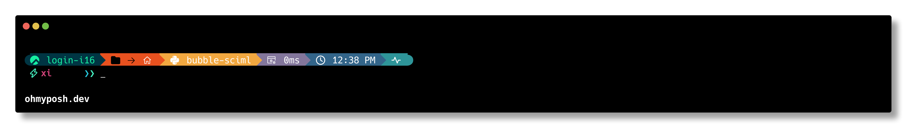

# Conda/Python Theme Based on Montys Theme

This theme is based on the Montys Theme for Oh-My-Posh and includes a display for Python/Anaconda virtual environments.

Installation Instructions

	1. On your Linux system, locate the .cache/oh-my-posh/themes/ directory.
	2. Place the montys_conda.omp.json file in this directory.
	3. Open your .zshrc file and add or modify the following line:

`export POSH_THEME='/data/homezvol2/xianwz2/.cache/oh-my-posh/themes/montys_conda.omp.json'`

Save the changes and restart your terminal to apply the new theme.

